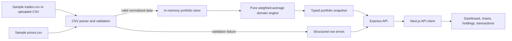

# Crypto Portfolio Analytics

A full-stack portfolio dashboard for importing cryptocurrency trades, validating CSV data, and calculating weighted-average cost basis and profit/loss. The repository contains two independent applications modeled after the Bot Farm BE/FE structure:

- `crypto-portfolio-be`: Express API, CSV validation, in-memory dataset store, and the financial domain engine.
- `crypto-portfolio-fe`: Next.js App Router dashboard consuming typed, calculated API snapshots.

The backend is the only owner of financial calculations. The frontend formats and visualizes returned values but does not recalculate cost basis or P&L.

## Prerequisites

- Node.js 20.9 or newer
- npm 10 or newer

## Run locally

Clone the repository and install both applications:

```bash
git clone https://github.com/vothanhdatt/crypto-portfolio-analytics.git
cd crypto-portfolio-analytics

cp crypto-portfolio-be/.env.example crypto-portfolio-be/.env
cp crypto-portfolio-fe/.env.example crypto-portfolio-fe/.env.local

npm --prefix crypto-portfolio-be install
npm --prefix crypto-portfolio-fe install
```

Start the backend and frontend in separate terminals:

```bash
npm --prefix crypto-portfolio-be run dev
```

```bash
npm --prefix crypto-portfolio-fe run dev
```

Open `http://localhost:3002`. The API is available at `http://localhost:1113`. On startup, the backend loads the committed sample files from `crypto-portfolio-be/data`.

## Environment variables

### Backend: `crypto-portfolio-be/.env`

| Variable | Default | Required | Purpose |
| --- | --- | --- | --- |
| `PORT` | `1113` | No | HTTP port for the Express API. |
| `CLIENT_URLS` | `http://localhost:3002` | No | Comma-separated CORS allowlist. Values must match frontend origins exactly. |
| `REQUEST_BODY_LIMIT` | `5mb` | No | Express request-body limit. CSV upload middleware independently accepts one file up to 5 MB. |
| `APP_MODE` | `development` | No | Runtime mode exposed to backend configuration. |

### Frontend: `crypto-portfolio-fe/.env.local`

| Variable | Default | Required | Purpose |
| --- | --- | --- | --- |
| `NEXT_PUBLIC_API_BASE_URL` | `http://localhost:1113` | No | Base URL used by the browser API client. |
| `NEXT_PUBLIC_SITE_URL` | `http://localhost:3002` | No | Canonical frontend URL used by application metadata. |

`NEXT_PUBLIC_*` values are embedded in the browser build. Set production values before running `npm run build`.

## Development, test, and build commands

Run commands from the repository root unless noted otherwise.

| Scope | Command | Description |
| --- | --- | --- |
| All tests | `npm test` | Runs the complete backend calculation, validation, store, API, and benchmark suite. |
| Backend | `npm --prefix crypto-portfolio-be run dev` | Starts Express with automatic reload. |
| Backend | `npm --prefix crypto-portfolio-be start` | Starts Express without a watcher. |
| Backend | `npm --prefix crypto-portfolio-be test` | Runs all Node test files. |
| Backend | `npm --prefix crypto-portfolio-be run lint` | Lints backend source and tests. |
| Backend | `npm --prefix crypto-portfolio-be run format` | Applies Prettier to backend JavaScript. |
| Frontend | `npm --prefix crypto-portfolio-fe run dev` | Starts Next.js on port 3002. |
| Frontend | `npm --prefix crypto-portfolio-fe run lint` | Lints frontend source. |
| Frontend | `npm --prefix crypto-portfolio-fe run typecheck` | Runs TypeScript without emitting files. |
| Frontend | `npm --prefix crypto-portfolio-fe run build` | Creates the production Next.js build. |
| Frontend | `npm --prefix crypto-portfolio-fe start` | Serves the previously built app on port 3002. |

A complete pre-review check is:

```bash
npm test
npm --prefix crypto-portfolio-be run lint
npm --prefix crypto-portfolio-fe run lint
npm --prefix crypto-portfolio-fe run typecheck
npm --prefix crypto-portfolio-fe run build
```

## API

| Method | Path | Behavior |
| --- | --- | --- |
| `GET` | `/api/portfolio` | Returns the active calculated portfolio snapshot. |
| `POST` | `/api/import` | Validates a multipart trade CSV and atomically replaces the active trades on success. |
| `POST` | `/api/reset` | Restores the committed sample trades and recalculates the snapshot. |

An invalid import returns structured row-level errors and leaves the last valid dataset unchanged.

## Architecture and data flow



1. The backend reads and validates the sample trade and price CSV files at startup.
2. Trade rows are normalized and sorted by timestamp, then by trade ID for a deterministic tie-break.
3. The framework-independent calculator in `src/domain/portfolio` processes trades and values open positions using the supplied price snapshot.
4. The store swaps its active dataset only after parsing, validation, and calculation all succeed.
5. Express maps domain failures to HTTP errors and returns decimal values as strings in a typed snapshot.
6. The frontend renders that snapshot. Transaction search, filters, sorting, and pagination only change the table view; they never change portfolio calculations.

The main separation is:

```text
HTTP/UI -> application modules -> domain calculator
                    |                    |
             parsing and storage     pure data in/out
```

## Weighted-average cost basis

For an existing quantity `Q` and cost basis `C`, a trade with quantity `q`, execution price `P`, and fee `F` is processed as follows.

### BUY

```text
gross value     = q × P
new quantity    = Q + q
new cost basis  = C + gross value + F
average cost    = new cost basis / new quantity
```

The BUY fee is capitalized into cost basis.

### SELL

```text
average cost        = C / Q
cost removed        = average cost × q
net proceeds        = (q × P) - F
realized P&L change = net proceeds - cost removed
new quantity        = Q - q
new cost basis      = C - cost removed
```

The SELL fee reduces proceeds. A SELL larger than the available quantity is rejected; short positions are not supported. When a position closes fully, quantity and remaining cost basis are explicitly reset to zero. A later BUY starts a new open-position basis while historical realized P&L remains available.

### Valuation

```text
current value   = open quantity × current price
unrealized P&L  = current value - current cost basis
total P&L       = realized P&L + unrealized P&L
allocation      = asset current value / portfolio current value
```

An open position without a current price is rejected instead of being silently valued at zero.

## Decimal and rounding policy

- All financial arithmetic uses a cloned `decimal.js` context with 40 significant digits and `ROUND_HALF_UP`.
- Input decimals remain strings through parsing and API serialization. Native JavaScript floating-point arithmetic is not used by the financial engine.
- Intermediate results are not rounded. `toFixed()` without a decimal-place argument serializes the exact value available in the configured decimal context.
- The UI rounds only for presentation: USD amounts are normally shown to two decimal places, small unit prices may show up to eight decimal places, and allocation is displayed as a percentage.
- Charts may convert already-calculated API values to numbers for SVG geometry and labels. Those conversions never feed back into portfolio state.
- Tests compare exact values where appropriate and use two-decimal `ROUND_HALF_UP` reconciliation for currency values displayed by the dashboard.

## Assumptions and tradeoffs

- USD is the only reporting currency.
- Supported assets are BTC, ETH, SOL, CKB, and DOGE; supported exchanges are Binance and Coinbase.
- Trade sides are limited to `BUY` and `SELL`, quantities and prices must be positive, and fees must be non-negative.
- Timestamps must be valid UTC ISO-8601 values ending in `Z`.
- Weighted-average basis is maintained per asset across exchanges, not as separate exchange lots.
- The price CSV is a single valuation snapshot. All rows must share its `as_of` timestamp, and every open asset needs one price.
- The import endpoint replaces trades only. It continues to use the committed sample prices for valuation.
- The active dataset is process-local and in memory. It is shared by connected clients and resets when the backend restarts.
- Atomic import favors correctness over partial acceptance: one invalid row rejects the whole file.
- Client-side transaction filtering is simple and responsive for the 200-row sample, but is not intended for very large datasets.
- Authentication, user accounts, database persistence, tax-lot methods, and live market feeds are intentionally outside the assessment scope.

## Deployment

| Target | URL |
| --- | --- |
| Frontend | Not deployed publicly at the time of this submission |
| API | Not deployed publicly at the time of this submission |
| Repository | [github.com/vothanhdatt/crypto-portfolio-analytics](https://github.com/vothanhdatt/crypto-portfolio-analytics) |
| Local frontend | `http://localhost:3002` |
| Local API | `http://localhost:1113` |

Before deployment, set the frontend and API URLs for the target environment and configure `CLIENT_URLS` with the exact public frontend origin.

## Verification and engineering workflow

- [AI_WORKFLOW.md](./AI_WORKFLOW.md) records eight reviewed examples of AI-assisted analysis, architecture, implementation, testing, debugging, and rejected suggestions.
- [ACCESSIBILITY_QA.md](./ACCESSIBILITY_QA.md) records keyboard, semantic HTML, contrast, responsive overflow, live-region, console, and production-build checks.
- [CONTRIBUTING.md](./CONTRIBUTING.md) defines branch and commit conventions. Changes must not be implemented directly on `main` or `develop`.

The sample benchmark covers 200 transactions and reconciles summary values with the holdings table. It also verifies reversed CSV order, missing prices, invalid and duplicate rows, short-position rejection, atomic import failure, and allocation totaling approximately 100%.

## Future improvements

- Persist datasets per user in a database and add authentication and authorization.
- Import price files or integrate a versioned live market-price provider.
- Add historical snapshots, performance-over-time charts, and alternative cost-basis methods.
- Move transaction filtering and pagination to the API for large portfolios.
- Add downloadable reports and normalized CSV export.
- Add end-to-end browser tests, CI quality gates, dependency scanning, and automated deployment previews.
- Add request logging, metrics, tracing, rate limits, and production health monitoring.
- Add localization, configurable reporting currencies, and broader asset/exchange support.
